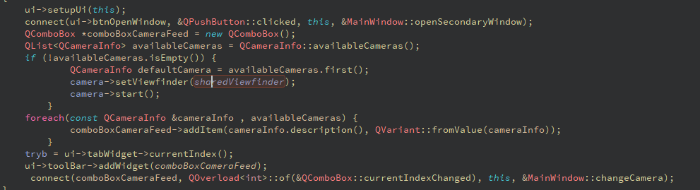
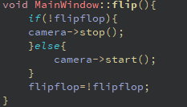
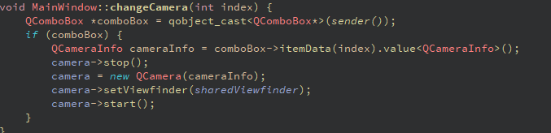
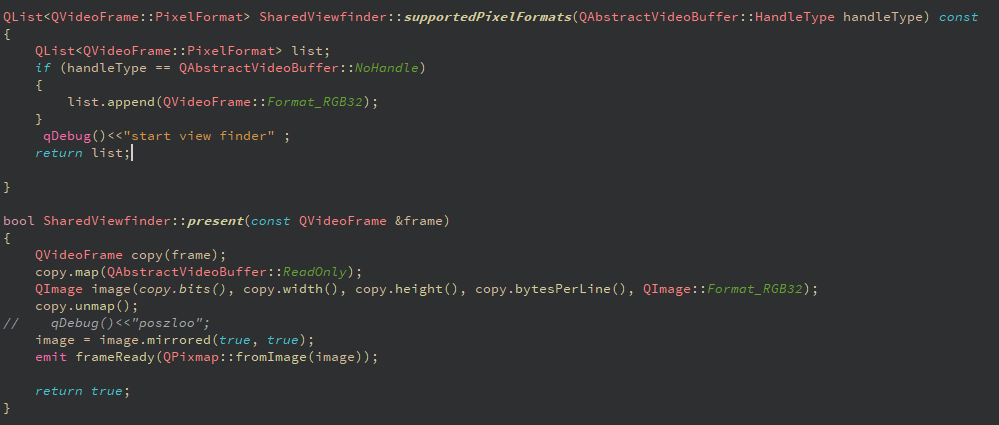
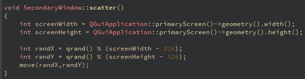

### Dokumentacja Multi Windows Camera - Dawid Rej

---
## Co to takiego?

Aplikacja Multi Windows Camera umożliwia jednoczesne wyświetlanie obrazu z jednej kamery na wielu oknach, oferując różne tryby wyświetlania, takie jak pełny ekran, odkrywanie fragmentów oraz symulację logo DVD. Kluczowe klasy to `MainWindow`, `SharedViewFinder` i `SecondaryWindow`, czyli kolejno, główna klasa do operowania na innych, klasa do kopiowania obrazu kamery i do wyświetlania go w innych okienkach. Napisane zostało w QT 5.0.2 Community na windows 11, korzystając z wbudowanej biblioteki qcore + multimedia (okropne nigdy więcej nie użyje multimedia)

#### Pliki

Aplikacja składa się z trzech plików CPP z odpowiednimi plikami nagłówkowymi oraz dwóch plików UI: jeden dla głównego okna, a drugi kopiowany wielokrotnie dla każdego okna z kamerą.

1. **MainWindow**
   - **Opis:**
     - Tworzy główne okno aplikacji z toolboxem do zmieniania kamery która jest wyświetlana.
     - Generuje listę dostępnych kamer, którą przypisuje do comboboxa w toolboxie.
     - Tworzy instancję klasy `QCamera` z wybraną kamerą.
     - Łączy przycisk, który pozwala na otwieranie nowych okienek.
     - 
     

   - **Funkcje:**
     - `void flip()`: Wyłącza aktualnie wybraną kamerę.
     - 
     - `void zmienKamere(int index)`: Zmienia aktualnie wybraną kamerę na podstawie indeksu z comboboxa.
     - 

2. **SharedViewFinder**
   - **Opis:**
     - Klasa pomocnicza, która umożliwia jednoczesne wyświetlanie obrazu z jednej instancji kamery na wielu widokach (`viewfinder`).
     - Emituje sygnał `frameReady`, który wysyła gotową klatkę kamery do widoków.
     - Dziedziczy po klasie `QAbstractVideoSurface`.
     - Formatuje obrazy do formatu RGB32, ponieważ wbudowana obsługa kamery w QT nie obsługuje lepszych formatów kolorów. (ogólnie moduł multimedia w qt słaby jest ja nie fan)
     - 

3. **SecondaryWindow**
   - **Opis:**
     - Klasa odpowiedzialna za tworzenie dodatkowych okien poprzez `MainWindow`.
     - Posiada dwie funkcje:
       - `void aktualizujWidok()`: Wywoływana przy każdej klatce, aktualizuje widok w zależności od trybu.
       - `void rozrzucOkna()`: Rozmieszcza okna na ekranie w losowych koordynatach.
     - 
     

   - **Tryby wyświetlania:**
     - **Tryb 1:** Pokazuje cały obraz z kamery, dzieląc go na liczbę okien.
     - **Tryb 2:** "Odkrywa" fragmenty obrazu z kamery na ekranie poprzez rozszrzanie rozdzielczosci kamery na cały ekran (prawie)
     - **Tryb 3:** Symuluje odbijanie się logo DVD po ekranie, ale z obrazem z kamery na pełnym ekranie i pokazuje tylko części tego co na ekranie

---

#### Struktura Kodu

- **MainWindow**
  - `QCamera *camera;`
  - `QComboBox *cameraComboBox;`
  - `QPushButton *openNewWindowButton;`
  - Sloty:
    - `void changeCamera(int index);`
    - `void openSecondaryWindow();`
    - `void on_pushButton_Stop_clicked();`
    - `void on_tabWidget_currentChanged(int index);`
    - `void on_btnOpenWindow_2_clicked();`
    - `void on_pushButton_Stop_2_clicked();`
    - `void on_pushButton_clicked();`
    - `void on_btnOpenWindow_3_clicked();`

- **SharedViewFinder**
  - Dziedziczy po `QAbstractVideoSurface`
  - Sygnały:
    - `void frameReady(const QImage &frame);`
  - Funckje:
    - `bool present(const QVideoFrame &frame);`

- **SecondaryWindow**
  - `QLabel *viewFinder;`
  - Sloty:
    - `void frameReady(QPixmap pixmap);`
    - `void scatter();`

---

#### Opis działania

1. **Inicjalizacja:**
   - Po uruchomieniu aplikacji, `MainWindow` inicjalizuje listę dostępnych kamer i przypisuje ją do comboboxa.
   - Użytkownik może wybrać kamerę z listy, która zostanie ustawiona jako aktywna.

2. **Otwieranie nowych okien:**
   - Przycisk w `MainWindow` pozwala na otwieranie nowych okien (`SecondaryWindow`), które automatycznie ustawiają się w losowej lokalizacji na ekranie.

3. **Wyświetlanie obrazu:**
   - `SharedViewFinder` przetwarza obraz z kamery i emituje sygnał `frameReady`, który jest odbierany przez każde `SecondaryWindow`.
   - W zależności od wybranego trybu, obraz jest odpowiednio modyfikowany i wyświetlany.

---

## Galeria

.png)
.png)
.png)
.png)
.png)
.png)